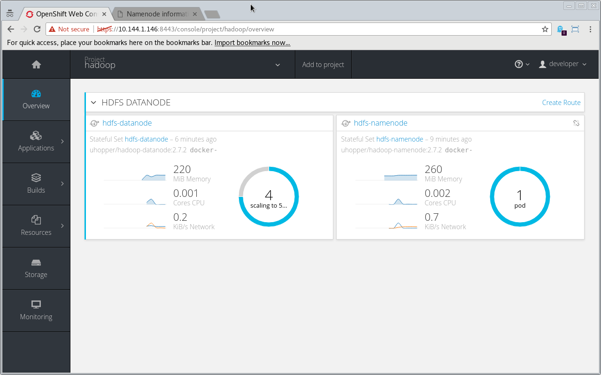

# Hadoop HDFS as an OpenShift StatefulSet

This is just a quick wrapup of half a day of work I put into Hadoop. It was primarly a preparation for the Spark work... more on that later.

## Prerequisites

An OpenShift 3.5 Cluster which is capabel of auto provisioning persistent volumes, these are used by the StatefulSets I used for the deployment.

### OpenShift on your local workstation

To set up such a cluster use ``oc cluster up --host-config-dir=`pwd`/openshift.local.config --host-data-dir=`pwd`/openshift.local.data --host-pv-dir=`pwd`/openshift.local.pv``, the `oc` binary could be downloaded from the release section of OpenShift Origin. This OpenShift cluster will persist all its configuration and data to the local disk, the directories given as command line arguments. If you dont want that, and discard all data during cluster stop or restart, ommit all the `--host-*-dir` arguments. Create the directories if they do not exist: `mkdir openshift.local.{config,data,pv}`.

## Create a project

All of the HDFS components will live in an OpenShift project called hadoop, a ServiceAccount is created, as the hadoop container images want to run as root. I reused a Hadoop container image by [uhopper](https://bitbucket.org/uhopper/hadoop-docker).

```
oc new-project hadoop
oc create sa hadoop
oc login -u system:admin
oc adm policy add-scc-to-user anyuid -z hadoop
```

## Deploying a Name Node

Lets start with the name node, it will be deployed using a StatefulSet, and it will expose two ports as a service: 8020 and 50070. 8020 is used for communication between data and name node, it is only available within the OpenShift cluster. 50070 is exposed via a Route, so that we can have a look at the web user interface.

```
oc create -f https://gitlab.com/goern/hdfs-openshift/raw/master/namenode.yaml 
oc create service loadbalancer hdfs-namenode --tcp=8020:8020 --tcp=50070:50070
oc expose service hdfs-namenode --port=50070
```

This command sequence deployes a name node StatefulSet, which will create a Pod with an associated PersistentVolume mounted at `/hadoop/dfs/`. 

Lets see what happened... OpenShift create a StatefulSet for us, which created a Pod running a container from container image `uhopper/hadoop-namenode:2.7.2`. This Pod has a Volume mounted which is backed by a PersistentVolumeClain named `hadoop-dfs-hdfs-namenode-0` generated by the StatefulSet. This PersistentVolumeClain is backed by a PersistentVolume provisioned from the local workstation. Try the following commands to trace that information down yourself:

```
$ oc get statefulsets
NAME            DESIRED   CURRENT   AGE
hdfs-namenode   1         1         1h

$ oc describe pod hdfs-namenode-0
Name:			hdfs-namenode-0
Namespace:		hadoop
Security Policy:	anyuid
[...]
Controllers:		StatefulSet/hdfs-namenode
Containers:
  hdfs-namenode:
    Container ID:	docker://1ae9163174d8cb4944f676c39a39344721713a600fbf9413c1146c38c60ff975
    Image:		uhopper/hadoop-namenode:2.7.2
[...]
    Volume Mounts:
      /hadoop/dfs from hadoop-dfs (rw)
      /var/run/secrets/kubernetes.io/serviceaccount from hadoop-token-rp8hm (ro)
[...]
Volumes:
  hadoop-dfs:
    Type:	PersistentVolumeClaim (a reference to a PersistentVolumeClaim in the same namespace)
    ClaimName:	hadoop-dfs-hdfs-namenode-0
    ReadOnly:	false
 [...]

$ oc get pvc
NAME                         STATUS    VOLUME    CAPACITY   ACCESSMODES   AGE
hadoop-dfs-hdfs-namenode-0   Bound     pv0079    100Gi      RWO,ROX,RWX   1h

$ oc describe pv pv0079
Name:		pv0079
Labels:		volume=pv0079
StorageClass:	
Status:		Bound
Claim:		hadoop/hadoop-dfs-hdfs-namenode-0
Reclaim Policy:	Recycle
Access Modes:	RWO,ROX,RWX
Capacity:	100Gi
Message:	
Source:
    Type:	HostPath (bare host directory volume)
    Path:	/home/goern/openshift.local.pv/pv0079
No events.

```

Cool, whats next? 

## Deploy Data Nodes

The next step is to create a StatefulSet for the data nodes. It is important to mention, that the name node was deployed with environment variable `HDFS_CONF_dfs_namenode_datanode_registration_ip___hostname___check` set to false. Have a look at `namenode.yaml`. This is very important, as it tells the name node not to check if the hostname presented by the data node maps back to the right IP. [Hadoop is doing that using `/etc/hosts` of the name node container](http://stackoverflow.com/a/17253326), this file will not resolve any data node hosts!

Ok, lets `oc create -f https://gitlab.com/goern/hdfs-openshift/raw/master/datanode.yaml` and verify that one pod got created:

```
$ oc get pods
NAME              READY     STATUS    RESTARTS   AGE
hdfs-datanode-0   1/1       Running   0          1h
hdfs-namenode-0   1/1       Running   0          1h
```

To have a look at the Hadoop view on the current status, retrieve the URL of the Web UI using `oc get route hdfs-namenode --template='{{.spec.host}}'` and open it up in a browser.

Now that we have a basic Hadoop cluster up, lets scale it up, start more data node Pods by `oc scale --replicas=3 statefulset hdfs-datanode`.



Et voilà!

Now that we got a HDFS cluster deploys on OpenShift, lets use it to store some data and analyse the data... head over to [http://radanalytics.io/](http://radanalytics.io/applications/pyspark_hdfs_notebook) and check out the Tutorials!

## Famous last words

Before you scal down the datanode StatefulSet, you need to tell Hadoop that one datanode will go away ;)